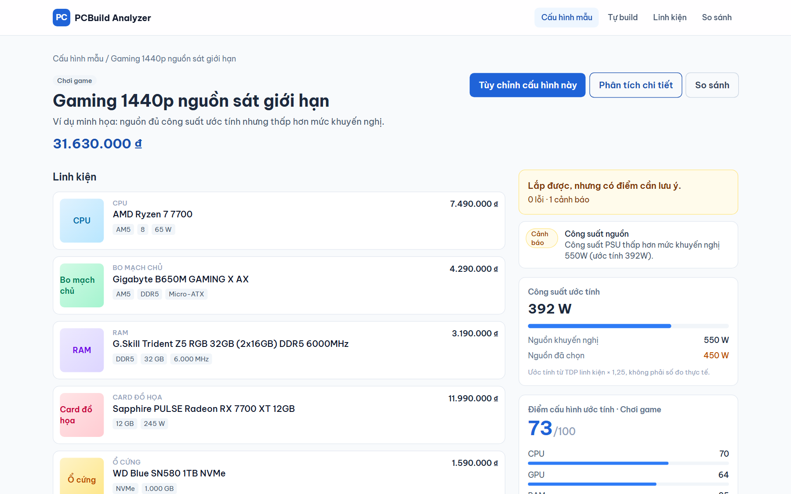
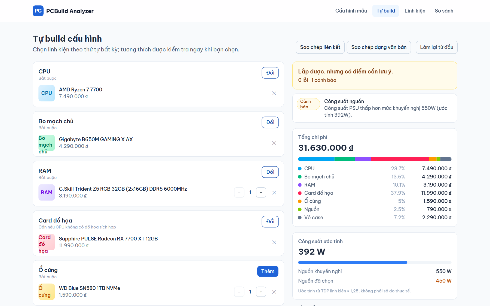
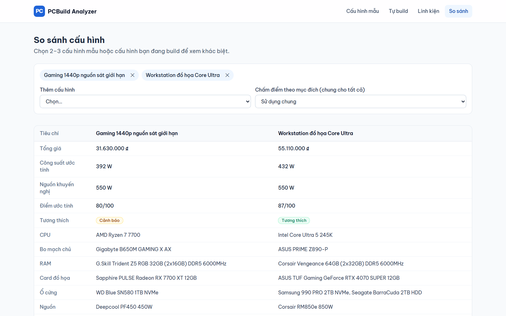
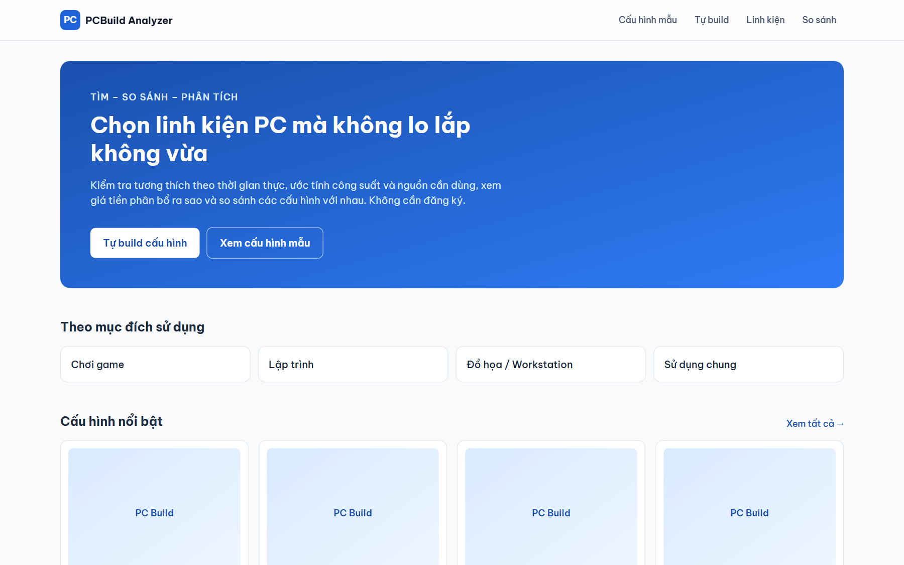
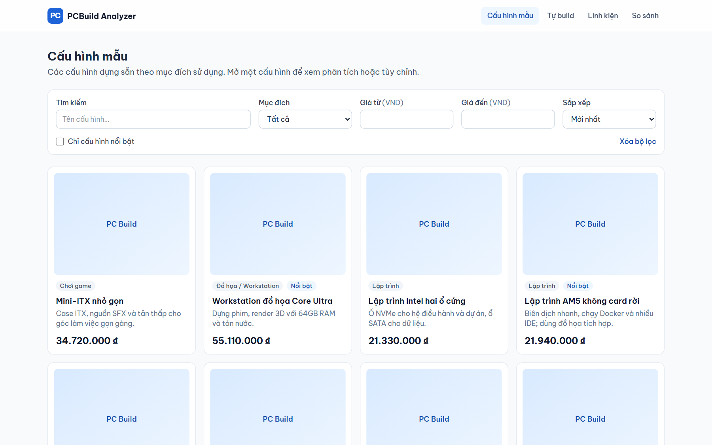
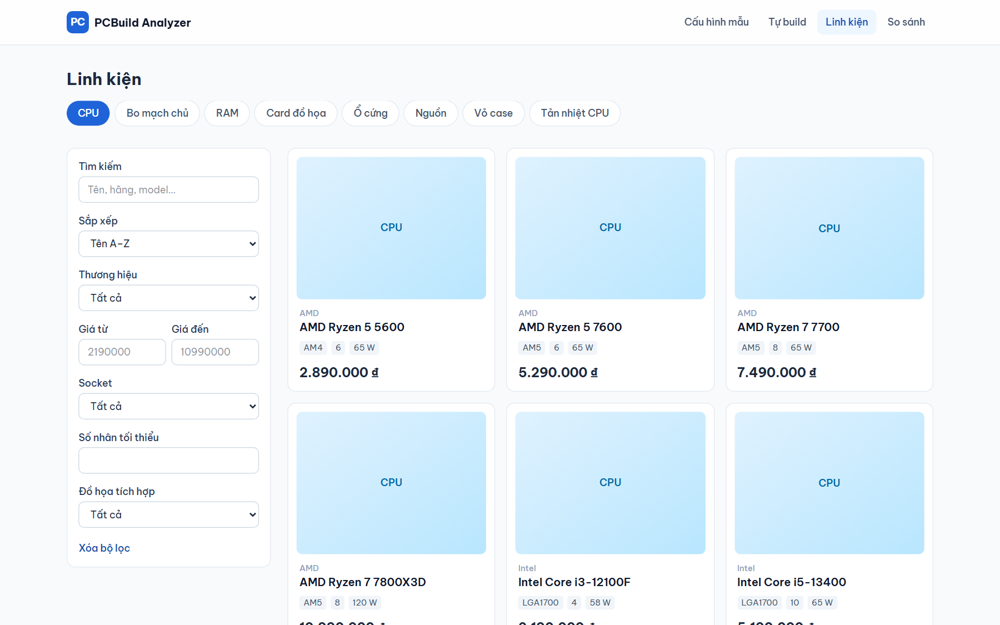
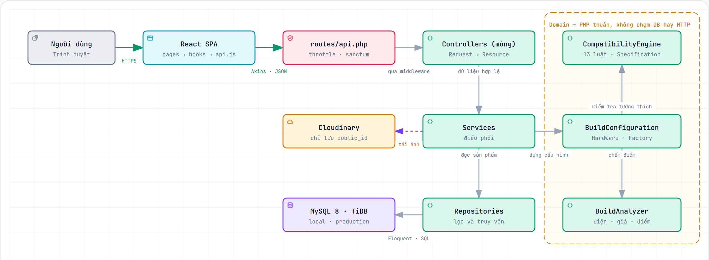

# PCBuild Analyzer

[](https://github.com/tridinh288/PCBuild-Analyzer/actions/workflows/ci.yml)


Ứng dụng web phân tích cấu hình PC: xem các cấu hình mẫu, tùy chỉnh lại hoặc tự build từ đầu, rồi
nhận ngay kết quả **kiểm tra tương thích**, **ước tính công suất** kèm mức nguồn khuyến nghị,
**phân tích giá** theo từng nhóm linh kiện và **điểm cấu hình ước tính** theo mục đích sử dụng.
Có thể so sánh nhiều cấu hình cạnh nhau và chia sẻ bằng link — **không cần tài khoản**.

Đây là đồ án cá nhân (Junior/Intern Fullstack). Trọng tâm là **engine phân tích cấu hình**, không
phải CRUD. Đây **không phải** trang thương mại điện tử: không có giỏ hàng, thanh toán hay đơn hàng.

## Demo

|  |  |
|---|---|
| **Web** | https://pcbuild-web.onrender.com |
| **API** | https://pcbuild-api-2mwk.onrender.com/api/status |

> Hosting miễn phí sẽ ngủ khi không có người dùng: request đầu tiên có thể mất khoảng 1 phút
> (giao diện hiện dòng "Máy chủ đang khởi động…").

## Hình ảnh

Ảnh chụp từ ứng dụng chạy thật với dữ liệu đã seed.

### Phân tích một cấu hình

Tương thích, công suất ước tính, nguồn khuyến nghị và điểm số — tất cả tính lại theo thời gian thực.



### Tự build cấu hình

Chọn linh kiện theo thứ tự bất kỳ. Mỗi lần chọn, engine chạy lại toàn bộ luật và cập nhật phân bổ chi phí.



### So sánh cấu hình

Đặt 2–3 cấu hình cạnh nhau. Bảng so sánh **không bao giờ tuyên bố cấu hình nào "thắng"** — chỉ trình bày khác biệt.



<details>
<summary><b>Xem thêm ảnh</b> — trang chủ, danh sách cấu hình mẫu, danh mục linh kiện</summary>







</details>

## Tính năng

- Xem, lọc và so sánh các cấu hình mẫu do admin dựng sẵn
- Tự build: tùy chỉnh từ một cấu hình mẫu hoặc bắt đầu từ con số không, theo thứ tự bất kỳ
- Kiểm tra tương thích theo thời gian thực — **13 luật**: socket, loại và dung lượng RAM, form factor,
  khoảng hở card đồ họa và tản nhiệt, công suất nguồn, cổng xuất hình…
- Ước tính công suất tiêu thụ và mức nguồn khuyến nghị
- Phân tích giá theo từng nhóm linh kiện (VND)
- Điểm cấu hình ước tính theo 4 hồ sơ: **Chơi game, Lập trình, Workstation, Sử dụng chung**
- Chia sẻ cấu hình bằng link hoặc dạng văn bản; tự lưu nháp
- Danh mục linh kiện với bộ lọc riêng cho từng nhóm
- Khu vực quản trị: linh kiện, cấu hình mẫu, hình ảnh

## Kiến trúc

<picture>
  <source media="(prefers-color-scheme: dark)" srcset="docs/images/architecture-dark.png">
  
</picture>

> Bản tương tác (bấm vào từng khối để mở đúng file mã nguồn):
> [`docs/images/architecture.html`](docs/images/architecture.html) — tải về rồi mở bằng trình duyệt.

Quy tắc quan trọng nhất là khung kẻ đứt màu cam: **Domain là PHP thuần**. Các lớp bên trong không
chạm vào database, HTTP hay `config()`; mọi giá trị cấu hình được truyền vào qua constructor lúc
container dựng object. Nhờ vậy:

- Test được bằng `PHPUnit\Framework\TestCase` trần, không cần khởi động Laravel — mỗi test vài mili giây.
- Engine chạy **giống hệt nhau** cho cấu hình mẫu (lấy từ database) và cấu hình tự build (chỉ nằm trên URL).

Một vài quyết định đáng chú ý khác:

| Quyết định | Lý do |
|---|---|
| Luật tương thích chỉ viết bằng PHP, **không nhân bản sang SQL** | Một nguồn sự thật duy nhất, tránh hai phiên bản luật lệch nhau |
| `config/hardware.php` là nguồn duy nhất cho spec, nhãn, đơn vị, luật slot và hằng số điện | Không có magic number rải rác trong code |
| Cấu hình tự build **không bao giờ lưu vào database** | Không cần tài khoản, chia sẻ bằng link là đủ |
| Controller mỏng, logic nằm ở Service và Domain | Controller chỉ điều phối HTTP |
| Rule và analyzer nhận `BuildConfiguration`, không nhận Eloquent model | Giữ Domain tách khỏi tầng dữ liệu |

Chi tiết: [docs/ARCHITECTURE.md](docs/ARCHITECTURE.md) · Nhật ký quyết định: [DECISIONS.md](DECISIONS.md)

## Công nghệ sử dụng

| Tầng | Công nghệ |
|---|---|
| Backend | PHP 8.3, Laravel 13, Eloquent, Sanctum (API token), PHPUnit |
| Frontend | React, Vite, JavaScript, React Router, Axios, Tailwind CSS |
| Database | MySQL 8 (local, chạy trong Docker) · TiDB Cloud Starter (production) |
| Hình ảnh | Cloudinary (chỉ lưu `public_id`) |
| Hạ tầng | Render (API là Docker web service, React là static site) |
| CI | GitHub Actions |

## Design pattern

MVC, Service Layer, Repository, Strategy, Factory, Specification, Dependency Injection — chỗ nào
dùng và chỗ nào **cố ý không dùng**:
[docs/ARCHITECTURE.md § 4](docs/ARCHITECTURE.md#4-design-patterns--where-and-where-not).

## Giới hạn của phần phân tích

Phần này quan trọng, xin nói rõ:

- **Công suất là số ước tính**, tính từ TDP của linh kiện cộng các hằng số cố định (hệ số 1,25).
  Đây không phải số đo thực tế.
- **Điểm cấu hình là thang điểm do dự án tự định nghĩa**, dựa trên mức hiệu năng do admin nhập tay.
  Đây không phải dữ liệu benchmark.
- **So sánh không bao giờ tuyên bố cấu hình nào thắng** — chỉ đặt các con số cạnh nhau.
- Phần tương thích mới phủ 13 luật kể trên. Một số ràng buộc vật lý khác (kích thước radiator,
  đầu cấp nguồn PCIe, số khay ổ cứng) **chưa được kiểm tra**.

## Yêu cầu môi trường

- PHP 8.3+ và Composer 2 (trên máy host, dùng cho tooling)
- Node.js 20+ (đã kiểm tra với 24) và npm
- Docker Desktop kèm Docker Compose
- Git

Kiểm tra: `php -v` phải báo 8.3 trở lên.

## Cài đặt (chạy local)

API và MySQL chạy trong Docker; React chạy trên host (D-025).

```bash
# 1. Biến môi trường
cp backend/.env.example backend/.env
#    đặt DB_PASSWORD=pcbuild_local (khớp docker-compose.yml) và ADMIN_EMAIL / ADMIN_PASSWORD

# 2. API + MySQL
docker compose up -d --build
docker compose exec app composer install
docker compose exec app php artisan key:generate
docker compose exec app php artisan migrate --seed

# 3. Kiểm tra
curl http://localhost:8000/api/status

# 4. Frontend (chạy trên host, D-025)
cd frontend
cp .env.example .env        # VITE_API_URL=http://localhost:8000/api
npm install
npm run dev                 # http://localhost:5173
```

MySQL mở ở cổng `3307` trên host (user `pcbuild`) để dùng với HeidiSQL hoặc client GUI khác.

> `VITE_API_URL` **phải có đuôi `/api`**. Thiếu phần này thì mọi request rơi vào 404 và trình duyệt
> báo "Không kết nối được máy chủ", vì CORS chỉ áp cho các đường dẫn `api/*`.

## Kiểm thử

**272 test backend** và **37 test frontend**, chạy tự động bằng GitHub Actions ở mỗi lần push.
Độ phủ dòng của backend là 98,5 % (đo ở Phase 7, xem [docs/TESTING.md](docs/TESTING.md)).
PHPUnit chạy trên database `pcbuild_test` riêng (tạo bởi `docker/mysql/init`); test **không bao giờ
gọi dịch vụ bên ngoài**.

```bash
docker compose exec app php artisan test                  # thêm --parallel --processes=4 cho nhanh
docker compose exec app php artisan app:verify-database   # kiểm tra truy vấn JSON và khóa ngoại
cd frontend && npm test                                   # test frontend (Vitest)
```

Báo cáo đầy đủ và bảng đối chiếu từng yêu cầu: [docs/TESTING.md](docs/TESTING.md).

## Triển khai

Render (API dạng Docker và static site, khai báo trong [`render.yaml`](render.yaml)), TiDB Cloud
Starter và Cloudinary — tất cả đều dùng gói miễn phí. Image của API là bản multi-stage nền Alpine
(`backend/Dockerfile`, 262 MB); script khởi động chạy migration, cache config và route, rồi phục vụ
trên `$PORT`.

Một điểm đáng lưu ý khi chạy sau proxy: trên Render, request đi qua **Cloudflare → proxy nội bộ của
Render → app**, nên `config/trustedproxy.php` phải liệt kê đủ các chặng đó. Dùng `'*'` sẽ cho phép
client tự giả IP và vượt rate limit; ngược lại, chỉ tin mạng nội bộ thì IP của Cloudflare bị hiểu
nhầm là IP người dùng. Chi tiết ở D-038 trong [DECISIONS.md](DECISIONS.md).

Hướng dẫn từng bước, biến môi trường, cách kiểm tra và xử lý lỗi: [docs/DEPLOYMENT.md](docs/DEPLOYMENT.md).

## Hướng phát triển

- Thêm luật tương thích: kích thước radiator AIO với vỏ case, đầu cấp nguồn PCIe, số khay ổ cứng
- "Giải thích cấu hình này" bằng AI, chỉ dựa trên dữ liệu phân tích đã kiểm chứng
- Giao diện đa ngôn ngữ

## Tài liệu dự án

- [Đặc tả dự án](docs/PROJECT_SPEC.md)
- [Kiến trúc](docs/ARCHITECTURE.md)
- [Cơ sở dữ liệu](docs/DATABASE.md)
- [Tài liệu API](docs/API.md)
- [Kiểm thử](docs/TESTING.md)
- [Triển khai](docs/DEPLOYMENT.md)
- [Nhật ký quyết định](DECISIONS.md)
