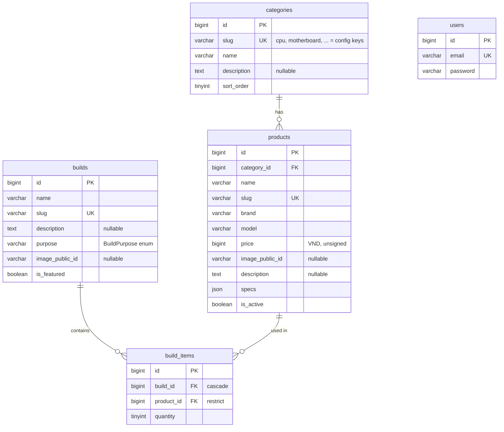

# Database & Hardware Config Design

Phase 1 planning output. Principles and decisions: spec section 8, D-004 to D-010.

---

## 1. ERD



All tables have `created_at` / `updated_at`. `users` and `personal_access_tokens` (Sanctum) are
not related to the hardware tables.

---

## 2. Tables

### categories

| Column | Type | Notes |
|---|---|---|
| id | BIGINT UNSIGNED PK | |
| slug | VARCHAR(32) UNIQUE | Must equal a key of `config('hardware.categories')`. Seeded, never created by admin (D-006) |
| name | VARCHAR(100) | Vietnamese display name, editable |
| description | TEXT NULL | Editable |
| sort_order | TINYINT UNSIGNED | Builder slot and menu order, editable |

### products

| Column | Type | Notes |
|---|---|---|
| id | BIGINT UNSIGNED PK | Not assumed consecutive (D-009) |
| category_id | BIGINT UNSIGNED FK → categories, RESTRICT | Category of a product never changes after creation (specs depend on it) |
| name | VARCHAR(150) | |
| slug | VARCHAR(180) UNIQUE | Generated from name, editable |
| brand | VARCHAR(60) INDEX | Filter + search |
| model | VARCHAR(100) | Search |
| price | BIGINT UNSIGNED | Integer VND (D-010) |
| image_public_id | VARCHAR(255) NULL | Cloudinary public_id only (D-022) |
| description | TEXT NULL | |
| specs | JSON | Keys/values validated against config (D-004, D-005) |
| is_active | BOOLEAN DEFAULT true | Deactivate instead of delete (D-007) |

Indexes: `(category_id, price)` for "category + sort by price", `brand`, unique `slug`.

### builds

| Column | Type | Notes |
|---|---|---|
| id | BIGINT UNSIGNED PK | |
| name | VARCHAR(150) | |
| slug | VARCHAR(180) UNIQUE | Public URL |
| description | TEXT NULL | |
| purpose | VARCHAR(32) INDEX | Cast to `BuildPurpose` (gaming, programming, workstation, general_use) |
| image_public_id | VARCHAR(255) NULL | |
| is_featured | BOOLEAN DEFAULT false | Home page |

No total price column (D-008, D-032).

### build_items

| Column | Type | Notes |
|---|---|---|
| id | BIGINT UNSIGNED PK | |
| build_id | FK → builds, ON DELETE CASCADE | Items belong to the build |
| product_id | FK → products, ON DELETE RESTRICT | Products used by templates cannot be deleted (D-007) |
| quantity | TINYINT UNSIGNED DEFAULT 1 | RAM: number of kits; storage: number of identical drives |

Unique `(build_id, product_id)`: the same product appears once per build, with a quantity.

### users and Laravel defaults

- `users`: Laravel default table, one admin row seeded from `ADMIN_EMAIL` / `ADMIN_PASSWORD`.
- `personal_access_tokens`: Sanctum, with `expires_at`.
- `cache` table kept (rate limiter uses the cache; `CACHE_STORE=database` works on Render's
  stateless containers). Sessions are not used by the API (`SESSION_DRIVER=array`); unused default
  tables (`sessions`, `jobs`, `password_reset_tokens`) are removed from the migrations to keep the
  schema readable.

---

## 3. Computing the build total price

`withSum('items', ...)` cannot compute it: the price is on `products` and the quantity on
`build_items`, so the sum needs `price × quantity` across a join. Plan (D-032):

```php
// Build model scope
public function scopeWithTotalPrice(Builder $query): void
{
    $query->addSelect(['total_price' => BuildItem::query()
        ->join('products', 'products.id', '=', 'build_items.product_id')
        ->whereColumn('build_items.build_id', 'builds.id')
        ->selectRaw('COALESCE(SUM(products.price * build_items.quantity), 0)'),
    ]);
}
```

Used for the build list (sort and price range filter). The detail page and analysis use
`PriceAnalyzer` on the loaded configuration, so both paths give the same number.

---

## 4. `config/hardware.php` structure

```php
return [
    'enums'      => [ /* code => Vietnamese/English label, shared by categories */ ],
    'categories' => [ /* slug => [name, sort_order (seed defaults), specs => [key => definition]] */ ],
    'slots'      => [ /* slug => builder slot rules */ ],
    'power'      => [ /* power estimate constants */ ],
    'scoring'    => [ /* sub-score tables, weights, strategy adjustments */ ],
];
```

### 4.1 Shared enums

| Enum | Codes | Used by |
|---|---|---|
| `socket` | am4, am5, lga1700, lga1851 | cpu.socket, motherboard.socket, cooler.supported_sockets |
| `ram_type` | ddr4, ddr5 | motherboard.ram_type, ram.ram_type |
| `board_form_factor` | atx, matx, itx | motherboard.form_factor, case.supported_form_factors |
| `psu_form_factor` | atx, sfx | psu.form_factor, case.supported_psu_form_factors |
| `storage_interface` | nvme, sata | storage.interface |
| `storage_form` | m2, 2_5, 3_5 | storage.form |
| `efficiency_rating` | white, bronze, silver, gold, platinum, titanium | psu.efficiency_rating |
| `cooler_type` | air, aio | cooler.type |

Shared codes are what let rules compare values directly (D-005).

### 4.2 Spec definition keys

| Key | Meaning |
|---|---|
| `label` | Vietnamese display label |
| `type` | `integer`, `boolean`, `enum`, `enum_list` |
| `enum` | Enum name (for `enum` / `enum_list`) |
| `unit` | Display unit (`W`, `GB`, `MHz`, `mm`) |
| `min`, `max` | Validation bounds for integers |
| `required` | `true`, or a condition like `['when' => ['type' => 'aio']]` |
| `highlight` | Shown on cards |
| `filter` | `exact`, `min`, `max`, `boolean`, `contains` (for `enum_list`) — omitted = not filterable |
| `filter_param` | Optional query parameter name, default = key (`min`/`max` use `<key>_min` / `<key>_max`) |

Display order = order of keys in the array.

### 4.3 Spec keys per category

| Category | Key | Type | Unit | Req. | Filter | Highlight |
|---|---|---|---|---|---|---|
| cpu | socket | enum socket | | ✓ | exact | ✓ |
| | cores | integer 1–128 | | ✓ | min | ✓ |
| | threads | integer 1–256 | | ✓ | | |
| | tdp | integer 1–500 | W | ✓ | | ✓ |
| | has_integrated_graphics | boolean | | ✓ | boolean | |
| | includes_cooler | boolean | | ✓ | | |
| | performance_tier | integer 1–100 | | ✓ | | |
| motherboard | socket | enum socket | | ✓ | exact | ✓ |
| | ram_type | enum ram_type | | ✓ | exact | ✓ |
| | ram_slots | integer 1–8 | | ✓ | | |
| | max_ram_gb | integer 8–512 | GB | ✓ | | |
| | form_factor | enum board_form_factor | | ✓ | exact | ✓ |
| | m2_slots | integer 0–8 | | ✓ | | |
| | sata_ports | integer 0–12 | | ✓ | | |
| ram | ram_type | enum ram_type | | ✓ | exact | ✓ |
| | capacity_gb (per kit) | integer 4–256 | GB | ✓ | exact | ✓ |
| | modules (per kit) | integer 1–8 | | ✓ | | |
| | speed_mhz | integer 1600–10000 | MHz | ✓ | min | ✓ |
| gpu | vram_gb | integer 1–48 | GB | ✓ | min | ✓ |
| | length_mm | integer 100–450 | mm | ✓ | max | |
| | tdp | integer 10–700 | W | ✓ | | ✓ |
| | performance_tier | integer 1–100 | | ✓ | | |
| storage | interface | enum storage_interface | | ✓ | exact | ✓ |
| | form | enum storage_form | | ✓ | | |
| | capacity_gb | integer 64–32000 | GB | ✓ | min | ✓ |
| psu | wattage | integer 200–2000 | W | ✓ | min | ✓ |
| | form_factor | enum psu_form_factor | | ✓ | exact | |
| | efficiency_rating | enum efficiency_rating | | ✓ | | ✓ |
| case | supported_form_factors | enum_list board_form_factor | | ✓ | contains (`form_factor`) | ✓ |
| | max_gpu_length_mm | integer 100–500 | mm | ✓ | min | |
| | max_cooler_height_mm | integer 30–200 | mm | ✓ | | |
| | supported_psu_form_factors | enum_list psu_form_factor | | ✓ | | |
| cooler | type | enum cooler_type | | ✓ | exact | ✓ |
| | supported_sockets | enum_list socket | | ✓ | contains (`socket`) | |
| | max_tdp | integer 30–400 | W | ✓ | | ✓ |
| | height_mm | integer 20–200 | mm | when type = air | | |
| | radiator_mm | integer 120–420 | mm | when type = aio | | |

Rule: a storage drive with `interface = nvme` must have `form = m2` (validated in the Form Request).
`MotherboardStorageSlotsRule` counts M.2 drives by `form = m2` and SATA drives by `interface = sata`.

### 4.4 Builder slots

| Slot | required | multiple | Limits |
|---|---|---|---|
| cpu | true | no | |
| motherboard | true | no | |
| ram | true | `quantity` (one kit product, 1–4 kits) | |
| storage | true | `items` (several products, each with quantity) | max 6 drives in total |
| gpu | `unless_cpu_has_integrated_graphics` | no | |
| psu | true | no | |
| case | true | no | |
| cooler | `unless_cpu_includes_cooler` | no | |

Conditional values are named conditions interpreted by `SlotRules`, not code in config.

### 4.5 Power constants

```php
'power' => [
    'ram_per_module' => 5,      // W
    'storage'        => ['nvme' => 7, 'sata' => 5],
    'motherboard'    => 50,
    'fans'           => 15,
    'safety_factor'  => 1.25,
    'psu_steps'      => [450, 550, 650, 750, 850, 1000, 1200, 1600],
],
```

CPU and GPU contribute their `tdp`. A CPU using only integrated graphics adds no GPU power.

### 4.6 Scoring (project-defined, not benchmarks — D-015)

```php
'scoring' => [
    'integrated_graphics_score' => 15,
    'ram_capacity_scores'   => [8 => 30, 16 => 60, 32 => 85, 64 => 100],  // total GB → score
    'ram_type_bonus'        => ['ddr4' => 0, 'ddr5' => 10],             // capped at 100
    'storage_interface_scores' => ['sata' => 50, 'nvme' => 80],
    'storage_capacity_bonus'   => [1000 => 10, 2000 => 20],             // total GB → bonus
    'weights' => [
        'gaming'      => ['cpu' => 0.30, 'gpu' => 0.45, 'ram' => 0.15, 'storage' => 0.10],
        'programming' => ['cpu' => 0.40, 'gpu' => 0.10, 'ram' => 0.30, 'storage' => 0.20],
        'workstation' => ['cpu' => 0.40, 'gpu' => 0.20, 'ram' => 0.30, 'storage' => 0.10],
        'general_use' => ['cpu' => 0.25, 'gpu' => 0.25, 'ram' => 0.25, 'storage' => 0.25],
    ],
    'adjustments' => [                                                   // D-031
        'gaming'      => ['max_cpu_gpu_tier_gap' => 30, 'penalty' => 10],
        'programming' => ['min_ram_gb' => 16, 'penalty' => 10],
        'workstation' => ['min_ram_gb' => 32, 'penalty' => 10],
    ],
],
```

Exact numbers are tuned in Phase 3 with unit tests; the structure is what Phase 1 fixes.

---

## 5. Queries to verify on TiDB (Phase 2, step 9)

| Query | Laravel | SQL produced (MySQL grammar) |
|---|---|---|
| Enum filter | `where('specs->socket', 'am5')` | `json_unquote(json_extract(specs, '$."socket"')) = ?` |
| Numeric min | `where('specs->cores', '>=', 8)` | string vs number comparison — check TiDB casts it numerically; otherwise use `whereRaw('CAST(... AS UNSIGNED) >= ?')` inside the repository |
| Boolean | `where('specs->has_integrated_graphics', true)` | `json_extract(...) = true` |
| Array contains | `whereJsonContains('specs->supported_sockets', 'am5')` | `json_contains(...)` |
| Total price | `withTotalPrice()` scope + `having`/`orderBy('total_price')` + paginate | correlated subquery |

Also verify: foreign keys enforced (TiDB supports FK since v6.6 — confirm on Starter), JSON column
type, `BIGINT UNSIGNED`, migrations run over TLS on port 4000.

---

## 6. Sample data plan

Seed data lives in `database/seeders/data/*.php` as plain arrays, one file per category, and is
validated with `SpecSchema` before insert (a seeder fails loudly on an unknown key or a wrong type).
Quantities and mix follow spec section 31, including:

- CPUs with and without iGPU / boxed cooler (so GPU and cooler slots become required or optional).
- Motherboards covering AM4/AM5/LGA1700, DDR4/DDR5, ATX/mATX/ITX.
- One ITX case + SFX PSU pair; one long GPU that does not fit a small case.
- 8–12 templates across all purposes, at least one with a warning (PSU close to the limit) —
  seeded templates are checked by the engine in a test so the demo data stays valid.
- Images: no manufacturer photos; per-category placeholders.
